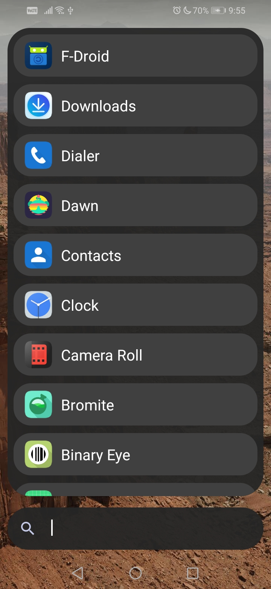
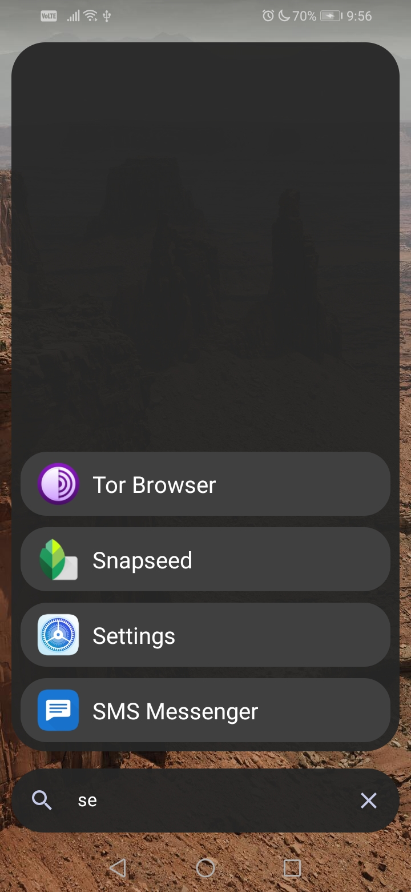
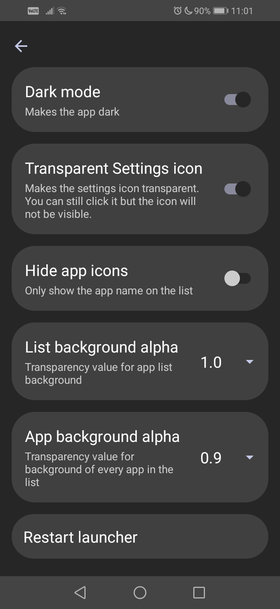
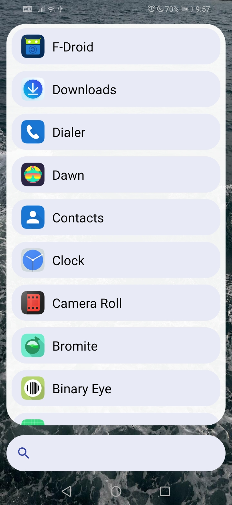
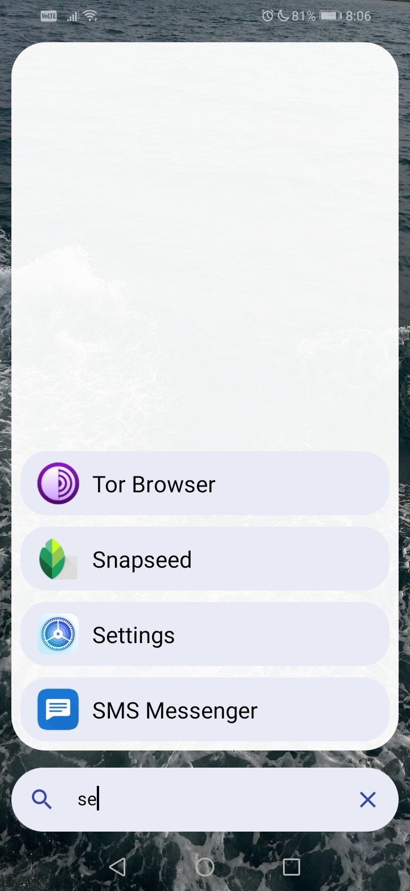
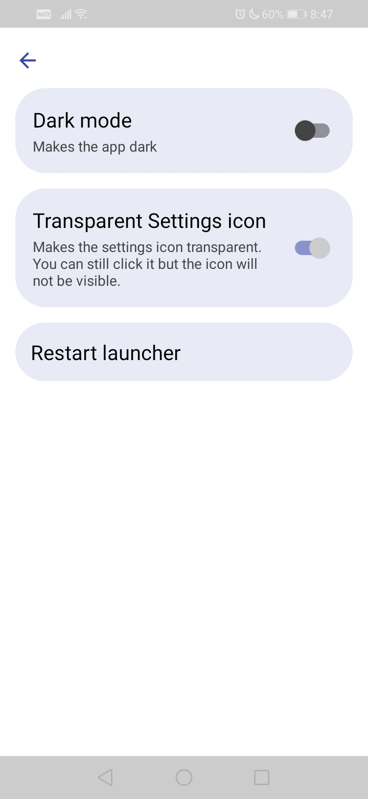

# Launchimo
A very minimalistic launcher app for Android written with Jetpack Compose. You can [download it from here](https://github.com/dybdeskarphet/launchimo/releases/download/1.1.0/app-release.apk)

## 🖼 Screenshots
### 🌑 Dark mode
|  |  |  |
|-----------------------------------------------------------------------------|-------------------------------------------------------------------------------|---------------------------------------------------------------------------------|

### ☀ Light mode
|  |  |  |
|------------------------------------------------------------------------------|--------------------------------------------------------------------------------|----------------------------------------------------------------------------------|
